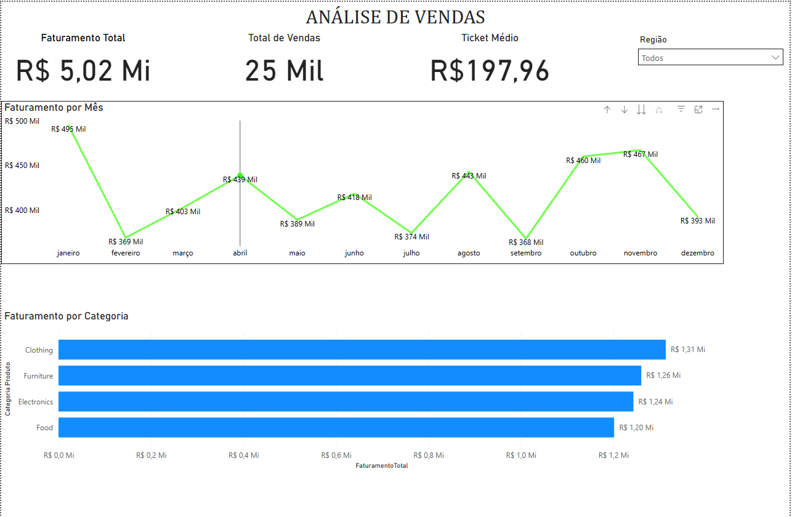

# 📊 Dashboard de Vendas - Power BI

## 📌 Objetivo
Analisar o desempenho de vendas ao longo do tempo e identificar padrões.

## 📈 Métricas
- Faturamento Total
- Total de Vendas
- Ticket Médio

## 🔍 Análises
- Evolução mensal de vendas
- Faturamento por categoria
- Filtro por região

## 💡 Insights
- Pico de vendas no final do ano
- Categoria Clothing com maior faturamento

## 🛠️ Ferramentas
- Power BI
- DAX
